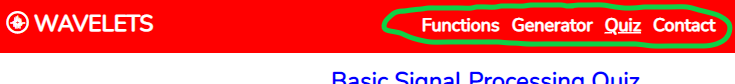
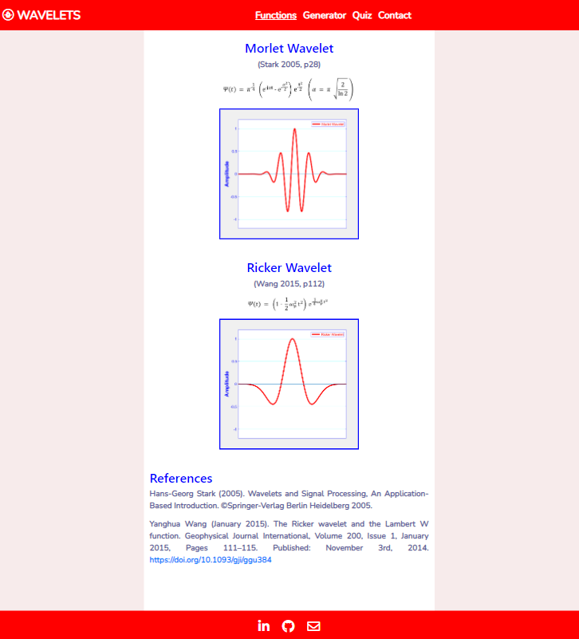
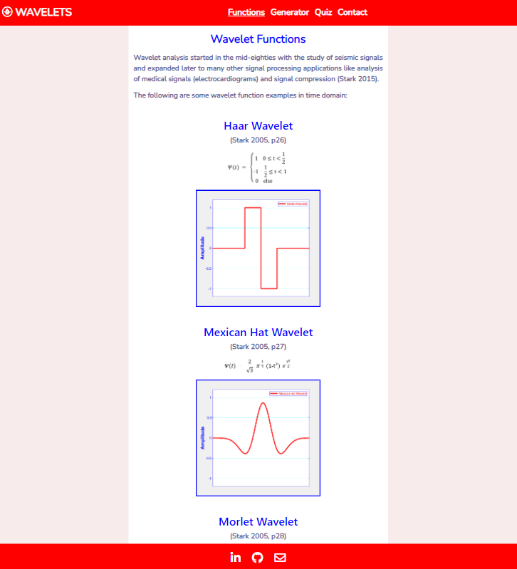
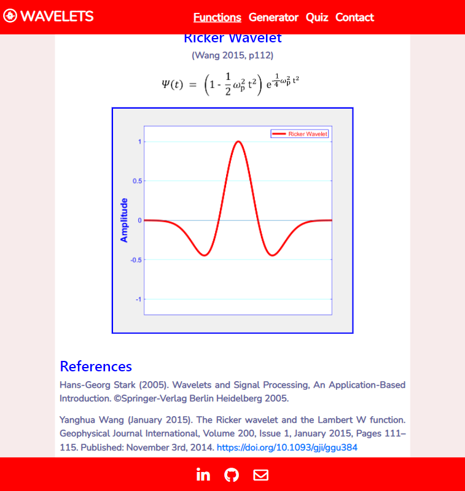
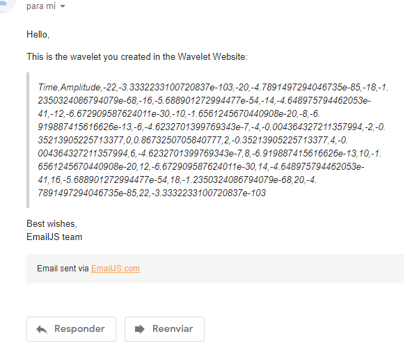

# *Sorry, website under construction*

# Wavelet Website

This website is about wavelet theory and generation. Except for the content referenced in this README file and/or the code and/or the website, all content is invented by me, anything matching reality is just a coincidence.

This repository belongs to my second milestone project in the Full-stack Development course at Code Institute, covering HTML, CSS and JavaScript along with Git version control and other software technologies.

The live link for this project is this one (https://csc7.github.io/PP2_CI_WW/).

Image obtained after checking the website in "Am I Responsive" website. The image shows the Functions page (Home) of the project in different devices. Image generated with Am I Responsive? website http://ami.responsivedesign.is/?url=https%3A%2F%2Fcsc7.github.io%2FPP2_CI_WW

# **Index**
#### [*Website Live Link*](https://csc7.github.io/PP1_CI_TGC/)
### [1. Project Goals](#1--project-goals)
### [2. User Experience](#2--user-experience)
- #### [User Goals](#user-goals-1)
- #### [Organisation/Site Owner Goals](#organisationsite-owner-goals-1)
- #### [User Stories](#user-stories-1)
- #### [User Requirements and Expectations](#user-requirements-and-expectations-1)
### [3. Design Choices](#3--design-choices)
- #### [Colours](#colours-1)
- #### [Fonts](#fonts-1)
- #### [Structure](#structure-1)
### [4. Wireframes](#4--wireframes)
### [5. Technologies used](#5--technologies-used)
- #### [Languages](#languages-1)
- #### [Software and Other Tools](#software-and-other-tools-1)
### [6. Features](#6--features)
### [7. Validation](#7--validation)
- #### [HTML Files](#html-files-1)
- #### [CSS File](#css-file-1)
- #### [Accessibility](#accessibility-1)
- #### [Performance](#performance-1)
### [8. Testing of User Stories](#8--testing-of-user-stories)
### [9. Bugs](#9--bugs)
### [10. Deployment](#10--deployment)
### [11. Credits](#11--credits)
### [12. Acknowledgements](#12--acknowledgements)
   

___
# **1 . Project Goals**
The goal of the project is to develop a website where seismic data processors, signal processors and/or any user can estimate, visualize and download a simple TXT file with the samples of a wavelet that they want to use in their processing tasks. In addition, a website where users can view and review the functions of the wavelets, challenge their knowledge against a quiz, and contact the website developer.

Specifically, the goals of the project are the following ones:
- To show the functions of the wavelets being calculated and plotted.
- To build graphs of wavelets based input parameters given by the user.
- To export the generated wavelet to a TXT file (just communication with server in this deployment version).
- To give users the chance to test their basic knowledge, thorough o quiz, about signals (very basic, just Nyquist and wave properties for this deployment version).
- To give users a contact form so they can send suggestions or comments if they wish.
- To show my work and give others the option to contact me if they wish.
  
## [Back to Index](#index)
 

___
# **2 . User Experience**

UX has been addressed (and remains as a constant activity) around Jesse James Garrett's process, whose five planes involves the following matters:
- **STRATEGY**: to build a website (product) that creates wavelet signals and gives the option to contact the developer.
- **SCOPE**: the minimum viable product needs to include features that allow the user to know the following:
    - Basic information about the about the functions being implemented (wavelet formulas).
    - A graph of the wavelet, using Google Charts (please see credit below), based on input parameters given by the user.
    - A section where user can input the type of wavelet, sampling rate, length of the signal and its frequency.
    - A "Generate" button.
    - An "Export" button.
    - A quiz with ten questions.
    - A contact form.
- **STRUCTURE**: the information is structured as follows:
    - Wavelet functions, in a separate page called "Functions".
    - Google Chart (please see credit below) graph, input parameters and generate/export buttons in a separate page called "Generator".
    - A quiz with ten questions in a separate page called "Quiz".
    - A contact form in a separate page called "Contact".
    - A fixed navigation bar on top.
    - A fixed footer.
- **SKELETON**: the information is accessed through a fixed navigation menu on top of the pages.
- **SURFACE**: the website is based on red, white and blue colours to give strong contrast and simoultaneously a "live" design.

ADD RESPONSIVENESS AND INTERACTIVITY REQUIREMNTS

## **User Goals**
- To have wavelet functions in a summarised way, at a glance.
- To select wavelet parameters and make the corresponding graphs.
- To export the wavelet to a TXT file so it can be used in other applications and/or processes.
- To check and/or entertain with a quiz.
- To be able to contact the developer if desired.

#### [Back to Index](#index)

## **Site Owner Goals**
- To provide very basic tools and concepts about wavelet signals.
- To show his work.
- To give users the chance to contact the developer.
- To provide a basic and scalable website and framework for signal processing that allows for the incorporation of more tools in the future.

#### [Back to Index](#index)

## **User Stories**
User stories are divided into the following three groups:

- ### **First time users**
1. As a user, I want to find a responsive website, so I can access it in any device without having the content affected.
2. As a user, I want to find a summary of type of wavelets, so I do not need to research for them in different sites on the web.
3. As a user, I want fo have the functions (formulas) of the wavelets, so I do not need to go through long texts or the web to find them.
4. As a user, I want to select the input parameters of the wavelets and see the corresponding graph of them, so I see how my parameters are affecting the wavelets.
5. As a user, I want to have the wavelet I choose sent to my e-mail address, so I can have it available for other applications and/on for download without having to use other applications that could take a longer time for the generation of the wavelet.
6. As a user, I want to have the option to send comments or questions, so I can contribute with the website devolpment and/or indicate errors or bugs.

- ### **Returning users**
7. As a returning user, I want to have the website accessible from any device, so I do not depend on only one device to access the information.
8. As a returning user, I want a navigation menu on top and always visible, so I can access any content in the website from there and do not need to use the back button of the browser.
9. As a returning user, I want to have a reference website with a summury of types and functions of wavelets so I do not need to look for them and/or check in different websites.
10. As a returning user, I want to generate new wavelets so I can check them in a quick way.
11. As a returning user, I want to test my knowledge against a quiz, so I refresh basic concepts and/or take a break to when I want to.
12. As a returning user, I want to have a way to send feedback or make consultations, so I can collaborate and/or make consultations about the website and/or its content.
13. As a returning user, I want to be informed if the contact form goes through, so I know if my message is sent or it is not.
14. As a returning user, I want to have a way to contact the developer so I can contribute and/or indicate errors or bugs.

- ### **Site Owner**
15. As owner, I want to create a website that provides a basic service (wavelet generation) so users can use it to check and obtain wavelets without using longer solutions for the generation/checking of them.
16. As owner, I want to create a website that is the base for further development, so I can keep showing my work and offer more solutions in the future.
17. As owner, alogn with other points of this section, I want to show my work and give the option to users to contact me if they wish.
18. As owner, I want to provide a website that can be browsed fully without using the back button, so users have a "map" of the website at all times and do not get issues while navigating (like sending data to a server interrupted or resent).
19. As owner, I want to provide a responsive website, so user can access it from any device without any constraint to navigate, find and/or use the website.
20. As owner, I want to give an interactive website that update colours, graphs and information, so users enjoy the navigation in the website and intantly know if the website works properly or it does not.
21. As owner, I want to put a brand in the top left, so users not only associate the brand with the website but also they can click it for the "home" (Functions) page.
22. As owner, I want to provide a website that summarises the type of wavelets so users can use it as a reference.
23. As owner, I want to give an interactive website, so users test their own wavelets without having to replicate the formulas with their own parameters themselves.
24. As owner, I want to provide a quiz so users can use the website as a basic entertainment when they want a short break from their activities.
25. As owner, I want to give as many options to be contacted as possible, so users can choose forms or links in the footer to send their consultations and/or feedback in a very fast way without having to navigate throuth the website.
26. As owner, I want to inform users if they consultation/message was succesfully sent, so they know if they need to resend it or they do not.
27. As owner, I want to inform the user, through an error page, if there is any error when loading the website.

#### [Back to Index](#index)

## **User Requirements and Expectations**
- A fixed and responsive navigation menu on top.
- A dedicated page for wavelet functions.
- A dedicated page for wavelet generation and export.
- A dedicated page for the basic signal processing quiz.
- A dedicated page for the contact form.
- A fixed footer with contact links to the developer.
- Strong contrast and "live" colours.
  
## [Back to Index](#index)
 

___
# **3 . Design Choices**

The design was planned to cover screen sizes from 320x568px to 1920x1370px.

## **Colours**
Red, white (as background) and blue is the base of the website. The goal is to provide strong contrast and use colours that show a vivid website.

#### [Back to Index](#index)

## **Fonts**
Google fonts (please see credits section below) were implemented in the website. Nunito/Montserrat were selected as the font pair for the website (following Google's suggestion), however only Nunito has been applied.
Sans-serif font is used as a back-up in case the previous font cannot be loaded.

Colour #rgb(98, 98, 161), dark blue, was selected for paragraphs, while red and blue for headings.

#### [Back to Index](#index)

## **Structure**
The metadata includes the following keywords to help search engines to find the website: wavelet, wavelets, signal, signals, signal processing, seismic processing, wavelet generation, txt, export, quiz. signal quiz, wavelet functions, wavelet formulas, wavelet summary, wavelet reference, processing, Code Institute, software development, student, full-stack course, milestone project.

The visible websites is organised in a header, a body and a footer.

Wireframes were developed at the beginning in order to have a first design of the website.

- ### **Header**

In order to achieve the goals related to easiness and/or simplicity, a fixed navigation area in the header is provided. In the same area, a logo with the idea of the website is place to the left.
The header contains the navigation bar with the four links to the body pages (please see next section).

- ### **Body**

The body of the pages are structured as follows for each of the pages:
- #### *Functions:*
    It contains a summary of wavelets (four type at the moment of deploying this website) and their mathematical functions. The idea is to add more with time, the page is designed to allow for an easy inclusion of the in the future, since it only involves paragraphs and headings whose width is 100% (with respect to their containers), so no more than adding the relevant tags is needed to add more types of wavelets and their functions.
- #### *Generator:*
    It has a section on the right (or top in tablet and cell phone screen sizes) with fields where the user can select the type of wavelet from a dropdown list and enter the sampling rate, length of wavelet and frequency of the desired wavelet to plot.
    The graph is generated with Google Charts (please see credit below) and is located on the left (of bottom in tablet and cell phone screen sizes).
- #### *Quiz:*
    It contains a start button on top, a progress bar below (which progress one step per question), a score and time panel below, and the quiz itself under these sections, which indeed contains a field where the user writes the answer and a button to send it.
- #### *Contact:*
    It has a simple contact form, center-aligned, with name, surname, e-mail and description fields, before it finds the send button.

- ### **Footer**

The footer contains links for social media (LinkedIn and GitHub) and e-mail. It is designed to remain fixed at the bottom of the webpages in order to have the links always visible to promote the developer of the website.\
  
## [Back to Index](#index)
 

___
# **4 . Wireframes**

Wireframes were developed in order to gather all goals, user stories, requirements and expectations, and have the design references for desktop, tablet and mobile devices.
Please check the PDFs files for each case in the following links:

[PDF File for Desktop Wireframe](docs/wireframes/wireframe-desktop.pdf)

[PDF File for Tablet Wireframe](docs/wireframes/wireframe-tablet.pdf)

[PDF File for Mobile Wireframe](docs/wireframes/wireframe-mobile.pdf)
  
## [Back to Index](#index)
 

___
# **5 . Technologies Used**

The following languages, software and tools were implemented using Windows 10 Pro:
## **Languages**
- #### **HTML**
- #### **CSS**
- #### **JavaScript**

#### [Back to Index](#index)

## **Software and Other Tools**
- #### **GitHub**
- #### **Gitpod**
- #### **Font Awesome (v5.15)**
- #### **Bootstrap (v4.0)**
- #### **EmailJS**
- #### **Balsamiq Wireframes (v4.2.4, Editor Version 2.6.0)**
- #### **Google Fonts**
- #### **MATLAB, The MathWorks, Inc. (to generate function plots in Functions page and obtain Morlet function)**
- #### **W3C Markup Validation Service**
- #### **W3C CSS Validation Service**
- #### **WAVE Web Accessibility Evaluation Tool**
- #### **Google Lighthouse (used in Google, Microsoft Edge and Firefox)**
- #### **Google Chrome, version 91.0.4472.114, Official Build, 64-bit (and its development tool)**
- #### **Microsoft Edge, version 91.0.864.59, Official build, 64-bit (and its development tool)**
- #### **Firefox, 89.0.2, 64-bit (and its development tool)**
- #### **Microsoft Internet Explorer, version 2004, OS Build 19041.1052**
  
## [Back to Index](#index)
 

___
# **6 . Features**

The website consists of four pages, where each of them is divided in three parts: header, body and footer. The features contained in each of the pages and parts are the following ones:

- ### **Website logo**

It is located in all pages, fixed, top-left, and always visible.
*User Stories Addressed by this Feature:* 8; 16; 17; 18 and 21.

*Please check "7. Testing of User Stories" for more details.*

    
Check Image

 

- ### **Fixed navigation menu**

It is located in the header, fixed on all pages to facilitate navigation, and responsive.
*User Stories Addressed by this Feature:* 1; 7; 8; 16; 17; 18; 19; 20 and 21.

*Please check "7. Testing of User Stories" for more details.*

    
Check Image

 

- ### **Summary of Functions**

It can be found in the Functions page and show the functions of the wavelts that can be plotted in the Generator page.
*User Stories Addressed by this Feature: 1; 2; 3; 7; 9; 16; 17; 19 and 22.

*Please check "7. Testing of User Stories" for more details.*

    
Check Images

 

- ### **Wavelet Generator**

It can be found in the Generator page and gives the option to select type of wavelet, sampling rate, length of wavelet and frequency. The wavelet generated can then be plotted using Google Charts and/or be sent to an e-mail address, informing the user if the email successfully goes through.
*User Stories Addressed by this Feature: 1; 4; 5; 7; 10; 15; 16; 17; 19; 20; 22 and 23.

*Please check "7. Testing of User Stories" for more details.*

    
Check Image

 

- ### **Wavelet Graph**

It can be found in the Generator page and graph the selected wavelet using Google Charts.
*User Stories Addressed by this Feature: 1; 4; 7; 10; 15; 16; 17; 19; 20; 22 and 23.

*Please check "7. Testing of User Stories" for more details.*

    
Check Image

 

- ### **Quiz**

It can be found in the Quiz page; it is a very simple interactive quiz of ten questions where users can test theri basic knowledge and/or take a brake when they want. It contains a panel with the amount of questions and correct ones, a timer, a progress bar, the last answer and the last correct answer. A start button launches the quiz, which is stopped automatically after the tenth questions, with an alert message.
*User Stories Addressed by this Feature: 1; 7; 11; 16; 17; 19; 20 and 24.

*Please check "7. Testing of User Stories" for more details.*

    
Check Image

 

- ### **Contact Form**

It can be found in the Contact and allows users to contact the website developer. It prevents the form to be sent with incomplete fields, informs the user if the message goes through and disables the send button in order not to send the consultation more than once.
*User Stories Addressed by this Feature: 1; 6; 7; 12; 13; 14; 17; 19; 20; 25 and 26.

*Please check "7. Testing of User Stories" for more details.*

    
Check Image

 

- ### **Footer**

It is located at the bottom of all pages, containing icons with links to LinkedIn, GitHub and e-mail application (to automatically load developer's e-mail address in the addressee field).
*User Stories Addressed by this Feature:* 1; 6; 7; 12; 14; 16; 17; 18; 19 and 25.

*Please check "7. Testing of User Stories" for more details.*

    
Check Image

 

- ### **404 page**

It is a different page that appears in case there is any issue when loading the page, like a similar incorrect URL. It contains a light red background and contains the message *"Sorry, something went wrong."*.
*User Stories Addressed by this Feature:* 17; 27.

*Please check "7. Testing of User Stories" for more details.*

    
Check Image

  
## [Back to Index](#index)
 

___
# **7 . Validation**

The introductory image on top of this README file was generated using the [Am I Responsive site](http://ami.responsivedesign.is/?url=https%3A%2F%2Fcsc7.github.io%2FPP1_CI_TGC) to test how the website displays in different screen sizes.

Development tools of Google Chrome (Version 92.0.4515.107, Official Build, 64-bit), Microsoft Edge (Version 92.0.902.62, Official build, 64-bit) and Firefox (Version 90.0.2, 64-bit) have been used to test the behaviour of the website for screen sizes between 320x568px to 1920x1370px.

The website was tested using these browsers and also Microsoft Internet Explorer (Version 2004, OS Build 19041.1110).

Samsung Internet (version 14.0.1.62) was used to test the website. Also, some users have collaborated checking the website in the cell phones, mostly with Android-based operating systems.

The following tools were used to validate the files of the website:

## **HTML Files**
https://validator.w3.org/ was used to validate the HTML files. All files ended up with zero errors and warnings.
Please check the evidence below:

    
Functions Page

 

    
Generator Page

    
Quiz Page

 

    
Contact Page

 

    
404 Page

 

#### [Back to Index](#index)

 

## **CSS File**
https://jigsaw.w3.org/css-validator/ was used to validate the CSS file.
Please check the evidence below:

    

            

     

    
CSS Filee

 
 

#### [Back to Index](#index)

  

## **JavaScript Files**
https://jshint.com/ was used to validate the JavaScript files.
Please check the evidence below:

    
Functions Page

 

    
Generator Page

    
Quiz Page

 

    
Contact Page

 

#### [Back to Index](#index)

 

## **Accessibility**
https://wave.webaim.org/ was used to validate accessibility. Although there are warnings, all pages contains zero errors. Please check evidence below:

    
Functions Page

 

    
Generator Page

    
Quiz Page

 

    
Contact Page

 

    
404 Page

 

#### [Back to Index](#index)

 

## **Performance**
Google Lighthouse (used in Google, Microsoft Edge and Firefox) were used to evaluate the performance of the pages. Please check the results below:

    
Functions Page for Mobile(94)

 

    
Functions Page for Desktop (99)

 

    
Generator Page for Mobile (98)

    
Generator Page for Desktop (99)

    
Quiz Page for Mobile (94)

 

    
Quiz Page for Desktop (99)

 

    
Contact Page for Mobile (91)

 

    
Contact Page for Desktop (100)

 

    
404 Page for Mobile (95, although it has been observed values from 84 to 99)

 

    
404 Page for Desktop (99)

 

  
## [Back to Index](#index)
 

___
# **8 . Testing of User Stories**

## **First time users**

The following are testing of User Stories previously described above:
  

1. As a user, I want to find a responsive website, so I can access it in any device without having the content affected.

| FEATURE | ACTION | EXPECTED RESULT | ACTUAL RESULT |
| --- | --- | --- | --- |
| Website | Design of pages and their visualization adapt to different screen sizes | Different designs in different devices showing correctly | Works as expected | 

    
Screenshot

 

  

2. As a user, I want to find a summary of types of wavelets, so I do not need to research for them in different sites on the web.

| FEATURE | ACTION | EXPECTED RESULT | ACTUAL RESULT |
| --- | --- | --- | --- |
| Summary of Functions | Scroll down to find all currently available types of wavelets | Find requested information, in one page | Works as expected | 

    
Screenshots

 

  

3. As a user, I want fo have the functions (formulas) of the wavelets, so I do not need to go through long texts or the web to find them.

| FEATURE | ACTION | EXPECTED RESULT | ACTUAL RESULT |
| --- | --- | --- | --- |
| Summary of Functions | Scroll down to find all currently available formulas for the types of wavelets | Find requested information, in one page | Works as expected | 

    
Screenshots

 

 

  

4. As a user, I want to select the input parameters of the wavelets and see the corresponding graph of them, so I see how my parameters are affecting the wavelets.

| FEATURE | ACTION | EXPECTED RESULT | ACTUAL RESULT |
| --- | --- | --- | --- |
| Wavelet Generator | Assign desired parameters in input fields and select type from dropdown list | Plot desired wavelet for checking. | Works as expected | 

    
Screenshot

  

5. As a user, I want to have the wavelet I choose sent to my e-mail address, so I can have it available for other applications and/on for download without having to use other applications that could take a longer time for the generation of the wavelet.

| FEATURE | ACTION | EXPECTED RESULT | ACTUAL RESULT |
| --- | --- | --- | --- |
| Wavelet Generator | Click on "E-mail Data" button to send the data to the desired e-mail address | Find information about projects | Works as expected | 

    
Screenshots

 

  

6. As a user, I want to have the option to send comments or questions, so I can contribute with the website devolpment and/or indicate errors or bugs.

| FEATURES | ACTION | EXPECTED RESULT | ACTUAL RESULT |
| --- | --- | --- | --- |
| Contact Form and Footer | Navigate to Contact page and/or fixed on bottom, always visible | Send form and/or use contact information in footer | Works as expected | 

    
Screenshots

 

 

  

## **Returning users**

7. As a returning user, I want to have the website accessible from any device, so I do not depend on only one device to access the information.

| FEATURE | ACTION | EXPECTED RESULT | ACTUAL RESULT |
| --- | --- | --- | --- |
| Website | Design of pages and their visualization adapt to different screen sizes | Different designs in different devices showing correctly | Works as expected | 

    
Screenshot

 

  

8. As a returning user, I want a navigation menu on top and always visible, so I can access any content in the website from there and do not need to use the back button of the browser.

| FEATURE | ACTION | EXPECTED RESULT | ACTUAL RESULT |
| --- | --- | --- | --- |
| Fixed navigation menu | Access it on top, fixed and always visible | Navigate to different pages | Works as expected | 

    
Screenshots

  

9. As a returning user, I want to have a reference website with a summury of types and functions of wavelets so I do not need to look for them and/or check in different websites.

| FEATURE | ACTION | EXPECTED RESULT | ACTUAL RESULT |
| --- | --- | --- | --- |
| Summary of Functions | Scroll down to find all currently available formulas for the types of wavelets | Find requested information, in one page | Works as expected | 

    
Screenshots

 

 

  

10. As a returning user, I want to generate new wavelets so I can check them in a quick way.

| FEATURE | ACTION | EXPECTED RESULT | ACTUAL RESULT |
| --- | --- | --- | --- |
| Wavelet Generator | Assign desired parameters in input fields and select type from dropdown list | Plot desired wavelet for checking. | Works as expected | 

    
Screenshot

  

11. As a returning user, I want to test my knowledge against a quiz, so I refresh basic concepts and/or take a break to when I want to.

| FEATURE | ACTION | EXPECTED RESULT | ACTUAL RESULT |
| --- | --- | --- | --- |
| Quiz | Navigate to Quiz page | Run quiz with Start button  | Works as expected | 

    
Screenshot

  

12. As a returning user, I want to have a way to send feedback or make consultations, so I can collaborate and/or make consultations about the website and/or its content.

| FEATURES | ACTION | EXPECTED RESULT | ACTUAL RESULT |
| --- | --- | --- | --- |
| Contact Form Footer | Navigate to Contact page and/or fixed on bottom, always visible | Send form and/or use contact information in footer | Works as expected | 

    
Screenshots

 

 

  

13. As a returning user, I want to be informed if the contact form goes through, so I know if my message is sent or it is not.

| FEATURE | ACTION | EXPECTED RESULT | ACTUAL RESULT |
| --- | --- | --- | --- |
| Contact Form | Indicate whether the form went through or it did not | Check message below Send button | Works as expected | 

    
Screenshot

  

14. As a returning user, I want to have a way to contact the developer so I can contribute and/or indicate errors or bugs.

| FEATURES | ACTION | EXPECTED RESULT | ACTUAL RESULT |
| --- | --- | --- | --- |
| Contact Form Footer | Navigate to Contact page and/or fixed on bottom, always visible | Send form and/or use contact information in footer | Works as expected | 

    
Screenshots

 

 

  

## **Site Owner**
15. As owner, I want to create a website that provides a basic service (wavelet generation) so users can use it to check and obtain wavelets without using longer solutions for the generation/checking of them.

| FEATURE | ACTION | EXPECTED RESULT | ACTUAL RESULT |
| --- | --- | --- | --- |
| Website | Navigate to all pages to find a summary of wavelet types and functions, an interactive wavelet generator with the capability of sending the wavelet to an e-mail address, a quiz to take a break and a contact form to send comments, suggestions or questions. | Find information and features in all website pages | Initial version deployed, working as expected | 

    
Screenshots

  

16. As owner, I want to create a website that is the base for further development, so I can keep showing my work and offer more solutions in the future.

| FEATURE | ACTION | EXPECTED RESULT | ACTUAL RESULT |
| --- | --- | --- | --- |
| Website | Similar to previous testing of user story (number 15). Find information, features and tools for further development in all pages. | Find information, features and tools in all website pages | Initial version deployed | 

    
Screenshots

  

17. As owner, alogn with other points of this section, I want to show my work and give the option to users to contact me if they wish.

| FEATURE | ACTION | EXPECTED RESULT | ACTUAL RESULT |
| --- | --- | --- | --- |
| Website, Contact page and footer | Check my work on different pages, contact me through the contact form in the Contact page and/or throught the links provided in the footer | Find information and contact options | Works as expected | 

    
Screenshots

 

 

  

18. As owner, I want to provide a website that can be browsed fully without using the back button, so users have a "map" of the website at all times and do not get issues while navigating (like sending data to a server interrupted or resent).

| FEATURE | ACTION | EXPECTED RESULT | ACTUAL RESULT |
| --- | --- | --- | --- |
| Website logo (for Functions page), fixed navigation menu and footer | Find them in any pages, always fixed, website logo and navigation menu on top, footer in the bottom | All website accessible without using the browser back button | Works as expected | 

    
Screenshots

 

 

  

19. As owner, I want to provide a responsive website, so user can access it from any device without any constraint to navigate, find and/or use the website.

| FEATURE | ACTION | EXPECTED RESULT | ACTUAL RESULT |
| --- | --- | --- | --- |
| Projects table | Scroll down in About Us page | Find information about projects | Works as expected | 

| FEATURE | ACTION | EXPECTED RESULT | ACTUAL RESULT |
| --- | --- | --- | --- |
| Website | Design of pages and their visualization adapt to different screen sizes | Different designs in different devices showing correctly | Works as expected | 

    
Screenshot

 

  

20. As owner, I want to give an interactive website that update colours, graphs and information, so users enjoy the navigation in the website and instantly know if the website works properly or it does not.

| FEATURE | ACTION | EXPECTED RESULT | ACTUAL RESULT |
| --- | --- | --- | --- |
| Website | Interactivity is mainly observable in Generator and Quiz pages | Check interactivity and responses in all pages, especially in Generator and Quiz pages | Works as expected | 

    
Screenshots

 

  

21. As owner, I want to put a brand in the top left, so users not only associate the brand with the website but also they can click it for the "Home" (Functions) page.

| FEATURE | ACTION | EXPECTED RESULT | ACTUAL RESULT |
| --- | --- | --- | --- |
| Website logo | Fixed on top left of all pages | Click for Functions page (Home) | Works as expected | 

    
Screenshot

 

  

22. As owner, I want to provide a website that summarises the type of wavelets so users can use it as a reference.

| FEATURE | ACTION | EXPECTED RESULT | ACTUAL RESULT |
| --- | --- | --- | --- |
| Summary of Functions | Scroll down to find all currently available types of wavelets | Find requested information, in one page | Works as expected | 

    
Screenshots

 

  

23. As owner, I want to give an interactive website, so users test their own wavelets without having to replicate the formulas with their own parameters themselves.

| FEATURE | ACTION | EXPECTED RESULT | ACTUAL RESULT |
| --- | --- | --- | --- |
| Wavelet Generator | Assign desired parameters in input fields and select type from dropdown list | Plot desired wavelet for checking. | Works as expected | 

    
Screenshot

  

24. As owner, I want to provide a quiz so users can use the website as a basic entertainment when they want a short break from their activities.

| FEATURE | ACTION | EXPECTED RESULT | ACTUAL RESULT |
| --- | --- | --- | --- |
| Quiz | Navigate to Quiz page | Run quiz with Start button  | Works as expected | 

    
Screenshot

  

25. As owner, I want to give as many options to be contacted as possible, so users can choose forms or links in the footer to send their consultations and/or feedback in a very fast way without having to navigate throuth the website.

| FEATURES | ACTION | EXPECTED RESULT | ACTUAL RESULT |
| --- | --- | --- | --- |
| Contact Form and Footer | Navigate to Contact page and/or fixed on bottom, always visible | Send form and/or use contact information in footer | Works as expected | 

    
Screenshots

 

 

  

26. As owner, I want to inform users if they consultation/message was succesfully sent, so they know if they need to resend it or they do not.

| FEATURE | ACTION | EXPECTED RESULT | ACTUAL RESULT |
| --- | --- | --- | --- |
| Contact Form | Indicate whether the form went through or it did not | Check message below Send button | Works as expected | 

    
Screenshot

  

27. As owner, I want to inform the user, through an error page, if there is any error when loading the website.

| FEATURE | ACTION | EXPECTED RESULT | ACTUAL RESULT |
| --- | --- | --- | --- |
| 404 page | Show 404 page when loading a page has been done with errors | Find a 404 page that is related to the website (not a default page from browser) | Works as expected | 

    
Screenshot

  

  

## [Back to Index](#index)
 

___
# 9 . Bugs

Some bugs were related to positioning of elements in the page. They were fixed by assigning proper values, most of them with the help of a temporary background colour for the element.

Then, many minor bugs were solved just by assigning the correct property and/or by trial and error.

Bugs who required more time and specific solutions were the following ones:

| Bug | Solution |
| ---- | ---- |
| The quiz was not able to read and compute the correct value of the answer | The issue was caused by an improper use of the textContent property, which replaced the content of the "p" element deleting its inner "span" elements. Solved with the help of the Code Institute's material by using the innerHTML property, where values for computation were read with the value property. | 
| The correct answers are generated ten times each, times the funcion is called, while the function returns only one value. This way, extra/useless memory is assigned. | The issue could be solved be creating a global variable and reading the values from there.|
| Time in Quiz page show three digits for the seconds, after 70 seconds has been taken by the quiz. | The issue was solved by adding an extra if contition for the case when seconds are greater than 70 seconds. Before it just added the value of secons, now it first check that the value is less than ten before assigning the value to the document.|
| Send button in Quiz page does not respond to width styling in CSS | Since the first id value (send-button) might have been interfering with another id (in a downloaded library, because it has not been found anywhere else in the files of this website), it was changed to "quiz-send-button", solving the issue and assigning a width similar to the answer/input box.|
| Fixed navigation header moves along with headings and body when expanding the menu after clicking the Bootstrap hamburguer button | Solved by adding a top property with a value of zero in the CSS style file.|
| Brand with website name and Bootstrap hamburguer button move up when expanding the menu after clicking the Bootstrap hamburguer button | Solved by adding a padding-bottom property with the same value of the previous added padding-top property in the CSS style file.|

  
## [Back to Index](#index)
 

___
# 10 . Deployment

The website was fully written in Gitpod, permanently tested with Gitpod preview, and periodically deployed to GigHub Pages (in a main branch).

The fully deployment to be accessible by anyone is found [here](https://csc7.github.io/PP2_CI_W), whose URL is https://csc7.github.io/PP2_CI_WW .

Based on the Code Institute's Love Running project content, the following steps has been applied to have the front-end final version deployed:
1. Select website repository in GitHub account.
2. Go to "Settings" (up in the menu, to the right).
3. Select "Pages" in the menu on the left.
4. At the beginning, in "Source", select "Branch: main", and click "Save".
5. The URL address of the deployed website will appear on top of the page, as can be observed in the screenshot below in the drop-down item.

    
GitHub Pages Screenshot

 

\
After first deployment, several updates have been carried out before the final version. These updates were implemented in the deployed website from Gitpod, just by using the "push" command for every commit (change) in the ongoing development.

The project can also be forked from the repository (https://github.com/csc7/PP2_CI_WW), please check for the "Fork" button, top-right of the page, to achieve this task.

  
## [Back to Index](#index)
 

___
# 11 . Credits

Code Institute: I have used the learning material in the course as a guide and reference. "Love Maths - Essentials Project" was the main reference for the Quiz page and "Sending Emails Using EmailJS" for sending e-mails from the contact form in the Contact page.

Love Maths - Essentials Project, from Code Institute, as a guide, source of design, concepts and code for this project, especially for the Quiz page.

Love Running - Essentials Project, from Code Institute, as a guide, source of design, concepts and code for this project.

Balsamiq Wireframes: I have used it to create all the wireframes.

Jesse James Garrett's process for user experience.

- Bootstrap:

    - Bootstrap Navbar, copied from https://getbootstrap.com/docs/4.0/components/navbar/, July 8th, 2021, at 00:35. Menu content modified.

    - Bootstrap CSS link: code copied on July 8th, 2021, 00:12, from https://getbootstrap.com/docs/4.0/getting-started/introduction/
    <link rel="stylesheet" href="https://maxcdn.bootstrapcdn.com/bootstrap/4.0.0/css/bootstrap.min.css"
        integrity="sha384-Gn5384xqQ1aoWXA+058RXPxPg6fy4IWvTNh0E263XmFcJlSAwiGgFAW/dAiS6JXm" crossorigin="anonymous">

    - Bootstrap Scripts - Code copied on July 8th, 2021, 00:17, from https://getbootstrap.com/docs/4.0/getting-started/introduction/

    Bootstrap JavaScript.
    
    
    

    - Bootstrap Navs (for footer): copied on July 8th, 2021, 03:20 from https://getbootstrap.com/docs/4.0/components/navs/ . Content modified.

    - To center elements in Navs and Navbar: justify-content-center class. Copied on July 8th, 2021, 03:43 from https://getbootstrap.com/docs/4.0/components/navs/ .

- Font Awesome:

    - Icon for WAVELET logo, downloaded on July 8th, 2021, 2:46 from https://fontawesome.com/v5.15/icons/creative-commons-sampling-plus?style=brands .

    - Font Awesome Script / Kit, link copied on July 8th, 2021, 02:54 from Font Awesome personal account.

    - Icon for LinkedIn: downloaded on July 8th, 2021, 03:02 from https://fontawesome.com/v5.15/icons/linkedin-in?style=brands .(<i class="fab fa-linkedin-in"></i>).

    - Icon for GitHub: downloaded on July 8th, 2021, 03:02 from https://fontawesome.com/v5.15/icons/github?style=brands . <i class="fab fa-github"></i>

    - Icon for E-mail/Envelope: downloaded on July 8th, 2021, 03:05 from https://fontawesome.com/v5.15/icons/envelope?style=regular . <i class="far fa-envelope"></i>

- Geeks for Geeks:

    - Positioning of footer on bottom: https://www.geeksforgeeks.org/how-to-create-footer-to-stay-at-the-bottom-of-a-web-page/; accessed on July 20th, 2021, at 00:20.

    - Icon for Google: downloaded on August 4th, 2021, 00:46 from https://fontawesome.com/v5.15/icons/google?style=brands .

- Google:

    - Google Fonts: Nunito (Regular 400) and Montserrat (Regular 400), first imported on July 19th, 2021, 23:05, from: https://fonts.google.com/; https://fonts.google.com/specimen/Nunito#license .

    - Google Charts: https://developers.google.com/chart . Accessed first time on July 24th, 2021, at 23:00. Getting started with https://developers.google.com/chart/interactive/docs/quick_start; at 23:04. Line charts with https://developers.google.com/chart/interactive/docs/gallery/linechart at 23:06.

- MATLAB:

    - The following pages were visited on July 25th, 2021, between 8:00 and 9:10 to consult plot properties:
        - https://uk.mathworks.com/help/wavelet/ref/wavefun.html#d123e93233 .
        - https://uk.mathworks.com/matlabcentral/answers/301349-how-to-set-different-colors-for-the-text-in-a-legend .
        - https://uk.mathworks.com/matlabcentral/answers/99232-how-can-i-change-the-gridline-color-without-changing-the-tick-and-tick-label-colors-in-matlab .
        - https://uk.mathworks.com/help/matlab/ref/matlab.graphics.illustration.legend-properties.html .
        - https://uk.mathworks.com/matlabcentral/answers/688854-legend-is-it-possible-to-remove-the-border-while-leaving-the-background-color .
        - https://uk.mathworks.com/matlabcentral/answers/32617-how-to-remove-ticks-from-the-x-axis .
        - https://uk.mathworks.com/matlabcentral/answers/9559-change-the-font-size-of-the-current-axis .
    - Morlet function: copied from Mathworks, https://uk.mathworks.com/help/wavelet/ref/morlet.html, on August 3rd, 2021, at 03:00.

- MDN Web Docs Moz://a;
    - Confirming return value of Math.floor() function, https://developer.mozilla.org/en-US/docs/Web/JavaScript/Reference/Global_Objects/Math/floor , accessed on July 24th, 2021, at 6:57.

    - https://developer.mozilla.org/en-US/docs/Web/JavaScript/Reference/Global_Objects/Math/pow, accessed on July 25th, 2021, 7:25.
    - https://developer.mozilla.org/en-US/docs/Web/JavaScript/Reference/Global_Objects/Math/log, accessed on July 25th, 2021, 7:27.

- Stack Overflow:

    - Assigning height for header and footer, and rest of screen for body: https://stackoverflow.com/questions/10228280/how-to-make-div-height-100-between-header-and-footer; accessed on July 20th, 2021, at 00:30.

    - https://stackoverflow.com/questions/256754/how-to-pass-arguments-to-addeventlistener-listener-function .
    - https://stackoverflow.com/questions/44935185/enable-and-disable-onkeydown-event .

    - Avoid resizing of text areas. https://stackoverflow.com/questions/5235142/how-do-i-disable-the-resizable-property-of-a-textarea, accessed on July 24th, 2021, at 8:44.

    - https://stackoverflow.com/questions/14395050/slice-array-from-n-to-last-element, accessed on July 25th, 2021, at 6:39.

    - How to change the colour of the focused field input data: https://stackoverflow.com/questions/25372834/input-box-text-color-with-css-wheather-on-focus-or-not, accessed on August 4th, 2021, at 00:26.

    - Blur method: https://stackoverflow.com/questions/4075057/javascript-unfocus-a-textbox, accessed on August 4th, 2021, at 4:00 .

- W3C. Copyright  2021 W3C  (MIT, ERCIM, Keio, Beihang):
    - How to introduce author in anchor element: https://www.w3.org/TR/2011/WD-html5-author-20110809/the-link-element.html, accessed on August 4th, 2021, at 00:06.

- W3Schools (Powered by W3.CSS):

    - Position of "div" elements: https://www.w3schools.com/css/css_positioning.asp; accessed on July 19th, 2021, at 23:55.
    - https://www.w3schools.com/jsref/met_document_addeventlistener.asp .
    - https://www.w3schools.com/js/js_timing.asp .
    - https://www.w3schools.com/jsref/jsref_gettime.asp .
    - https://www.w3schools.com/js/js_timing.asp .
    - https://www.w3schools.com/jsref/prop_pushbutton_disabled.asp .
    - https://www.w3schools.com/jsref/met_element_removeeventlistener.asp .

    - https://www.w3schools.com/tags/att_option_disabled.asp , accessed on July 25th, 2021, 7:19.

    - https://www.w3schools.com/css/css_form.asp. July 25th, 2021, at 23:45.

    - To define transition of properties in CSS: https://www.w3schools.com/css/css3_transitions.asp, accessed on July 31st, 2021.

    - JavaScript Form Validation. https://www.w3schools.com/js/js_validation.asp, first accessed on July 31st, 2021, at 8:23.

    - How to introduce author in anchor element: https://www.w3schools.com/tags/att_a_rel.asp, accessed on August 4th, 2021, at 00:07.

Back to Index
___
# 12 . Acknowledgements

I would like to acknowledge and thank the following people for being part of this project and for helping me in the development of it:
- To my wife and family, for always supporting and helping.
- Code Institute, for providing knowledge, guide, content and tools.
- My mentor, Mo, for helping with very valuable guide and support.
- Code Institute community in Slack for permanently being an online reference.
- All the valuable information provided by the sources mentioned above in the credits.

  
## [Back to Index](#index)
 
